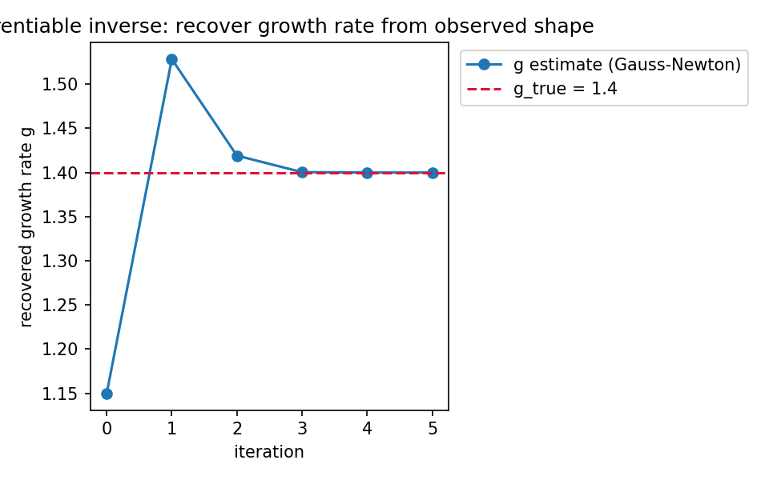
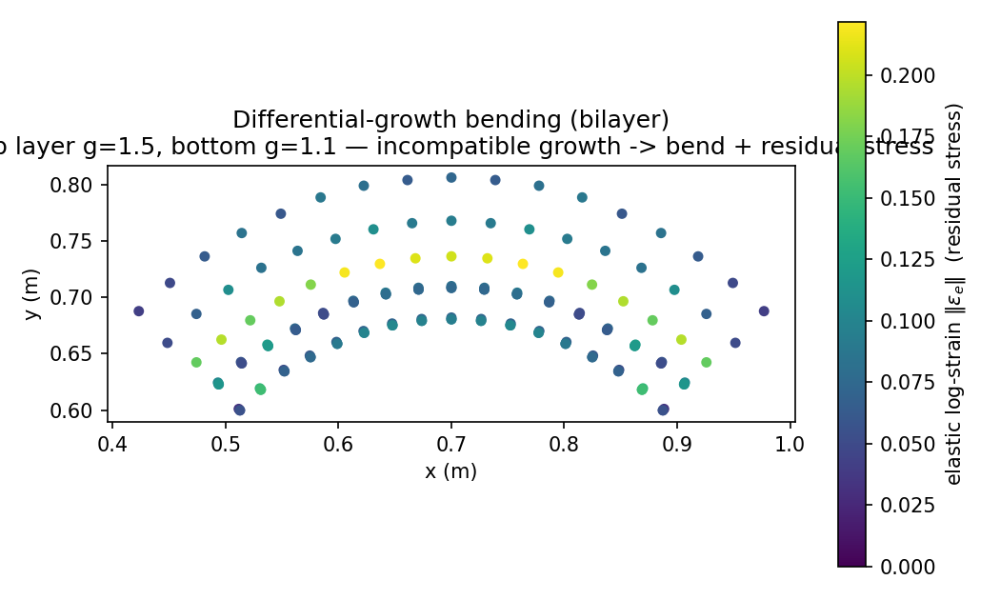

# morphompm

**A differentiable morphoelastic growth-MPM for soft / living matter.**

A small, heavily-verified [Material Point Method](https://en.wikipedia.org/wiki/Material_point_method)
solver for *morphoelastic growth* (`F = Fe·Fg`) with hand-written, finite-difference-gated
adjoints — so you can **infer material and growth laws from an observed shape** by
differentiating through the simulation.

> **Status: research work-in-progress.** The differentiable core is verified along three
> independent axes and is fully reproducible. It has **not** yet been validated against
> experimental data — that (against *published* morphogenesis datasets) is the next phase
> (`docs/PHASE3_morphogenesis.md`). Treat this as a verified method, not a validated result.

<p align="center">
  
  
</p>

## What it does

- **Forward:** MLS-MPM with morphoelastic growth. Constitutive models are pluggable
  (neo-Hookean, Hencky, a rate-dependent Herschel-Bulkley bioink) and injected into a
  material-agnostic transfer.
- **Adjoint:** every gradient (constitutive VJP, one MPM step incl. particle advection,
  full trajectory) is **hand-written and gated against finite differences** — not left to
  a framework's autodiff (which we found segfaults on these matrix-heavy kernels).
- **Inverse:** compose the module adjoints → recover a growth parameter from an observed
  final shape by gradient descent (the intended contribution).

## Install

```bash
pip install -e .            # installs the `morphompm` package (numpy, matplotlib)
```

The C++ forward oracle (optional, used for cross-checking) builds with CMake:

```bash
cmake -S . -B build -G "Visual Studio 17 2022" -A x64   # or your generator
cmake --build build --config Release
```

## Quickstart

```bash
python -m morphompm.verify     # run every verification gate (~seconds)
python scripts/reproduce.py    # one command: verify + C++ oracle + parity + regenerate figures/dashboard
```

## Verification (three independent axes + cross-implementation parity)

| Axis | What it guards | Typical result |
|------|----------------|----------------|
| FD-gradient gates | adjoint ↔ forward consistency | rel.err ≤ 1e-9 |
| forward-physics guard | forward *correctness* (free-swell `det F → g³`) | matches analytic |
| confined-swell analytic oracle | constitutive coefficients (catches μ↔λ swaps) | exact |
| numpy ↔ C++ parity | the two implementations agree | `max|ΔF|` ≈ 2e-5 |

FD gates verify *consistency*, not *correctness* — so the forward and analytic oracles are
separate axes (this split has caught real bugs). Runs are deterministic (single-thread).

## Repository layout

```
python/morphompm/     the package — config, state, constitutive, transfer, integrate, diff, io, verify
python/experiments/   Taichi ports (superseded; kept for the record — see banners)
include/morphompm/     C++ forward-oracle solver + self-contained linear-algebra core (math/)
tests/                 C++ oracle tests (analytic + Timoshenko bending)
scripts/               reproduce, parity, results (figures), make_dashboard, run_scene
docs/                  PROJECT_STATUS, PIPELINE (architecture), PHASE3 (roadmap), PREREG
outputs/figures/       preserved result figures (.png + .csv + _desc.md)
```

## Design notes

- **PIPELINE.md** — end-to-end architecture, module seams, substrate strategy, verification/validation spines.
- **PROJECT_STATUS.md** — current phase, decisions, honest open items.
- **PHASE3_morphogenesis.md** — the next stage: validate + invert against published morphogenesis data.
- Guiding principle: *deliverable-first* — build the minimum that a verifiable result needs;
  extend a seam only when a second consumer appears; keep every claim gated.

> Any literature values referenced in the docs are pointers to check against the primary
> source, not verified numbers.

## Citation & license

See `CITATION.cff`. Licensed under the MIT License (`LICENSE`).
